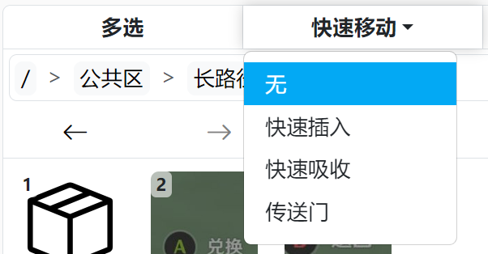
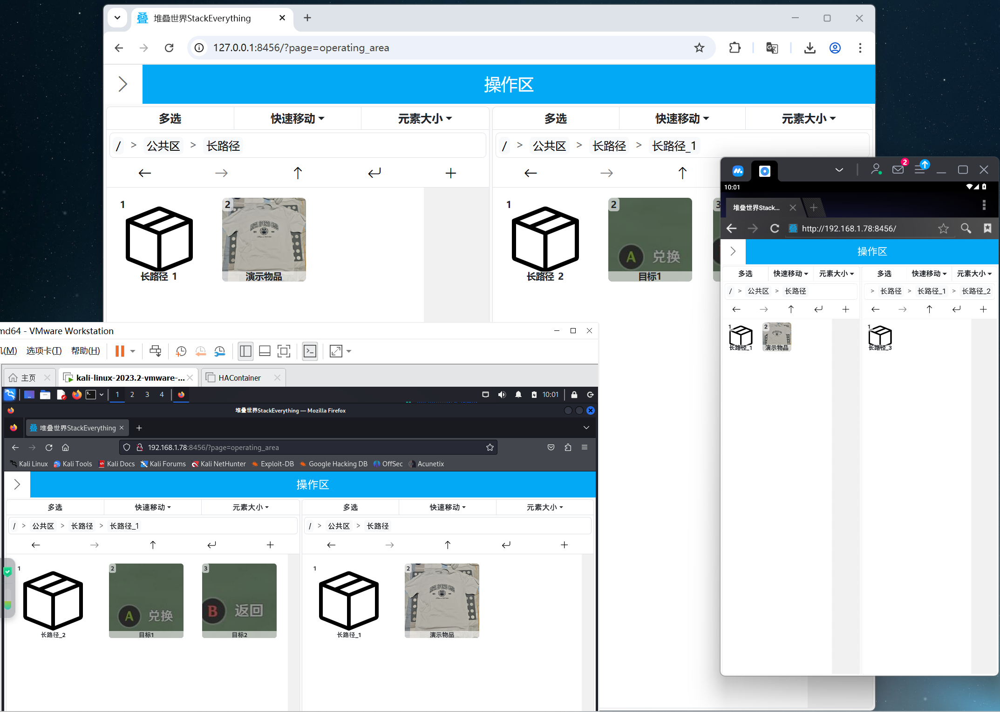
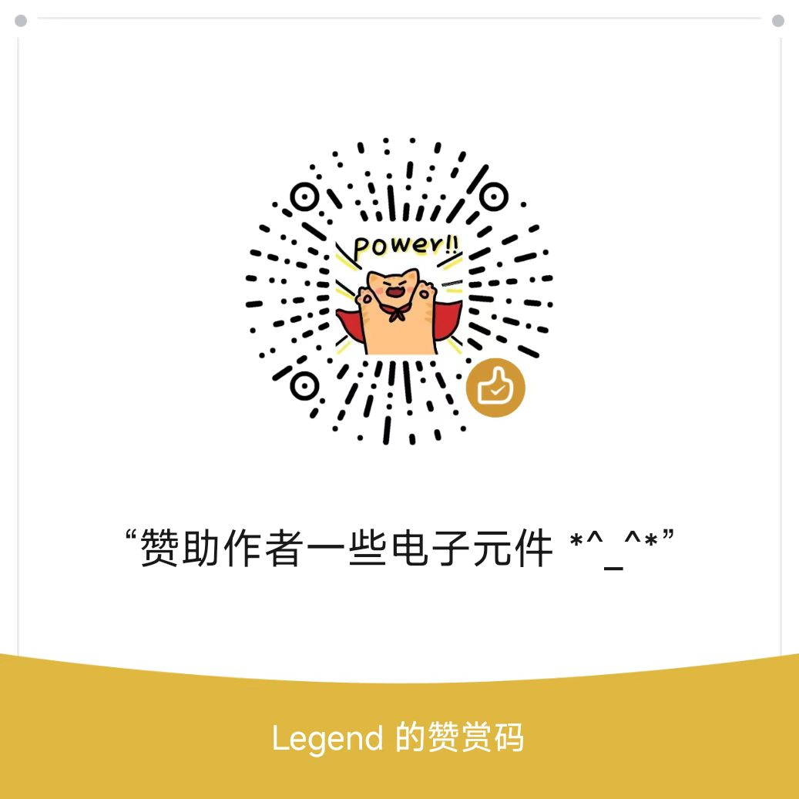

# 堆叠世界

[README in English](/i18n/README_en.md)

## 简介
不知道大家有没有这样的经历：我记得我有一件这样的衣服，但是我忘记这件衣服是在我家还是在学校了🤔；我叠的整整齐齐的衣服，在翻找衣服时翻着翻着就乱套了😦；一摞鞋盒，为了找一双特定的鞋得每个都掀开看一遍，到最后还没找到😠；过年冰箱冻的肉，到了年中才被发掘出来想起来吃😵……

为了解决“东西堆成一堆后查找特定物品难”的问题，我开发了“堆叠世界”这个家庭仓储系统。与传统仓储系统注重追踪物品数量不同，堆叠世界家庭仓储系统注重追踪物品位置。

## 特点
* **📁易于上手的UI**  
主操作界面采用类似windows资源管理器的界面，确保目录切换等操作信手拈来。  
  

* **🕹️直观的交互方式**  
拖拽即可移动物品，配合发光指示进行精准操作。  
  

* **🪄多样的移动模式**  
除了普通的单个拖拽外，堆叠世界还提供了多选、快速插入、快速吸收、传送门四种增加便捷性的移动模式（详细操作说明请见系统内的“帮助”页面）。  
  

* **🛜局域网任意访问**  
只要局域网内一台机器运行本软件，局域网内的任何设备上的浏览器都可以访问堆叠世界，发挥不同设备的长处。  
  

## 部署
_⚠️**安全警告**：由于本项目未实现身份验证机制，且默认使用Flask提供Web服务，因此**请勿将本服务直接暴露至公网**，否则可能导致严重的安全风险。_  
<br>
您可以通过`git clone`获取本项目，或者通过`Releases`界面下载最新或特定版本代码。  
本项目需要python>=3.7。获取本项目代码后，在项目文件夹内执行下方命令安装项目所需依赖（flask和pillow）  
```shell
pip install -r requirements.txt
```
随后启动服务即可  
```shell
python StackEverything.py
```
在本机上访问[127.0.0.1:8456](http://127.0.0.1:8456)即可打开堆叠世界。如果是通过其它设备访问，则访问`主机IP:8456`即可。  
打开堆叠世界页面后，点击左上角的“>”即可展开页面选择侧边栏，点击“帮助”界面即可查看的堆叠世界操作指南。  
<br>
有些参数是用户可设置的，例如语言。详细可设置参数请见[config.py](config.py)。

## 问题/建议
提交Issue即可。如果是问题，最好说明当时进行的操作、目录结构、关键日志信息；如果是建议，最好附带使用场景，或说明会解决当前的哪些痛点。

## 赞赏
如果您喜欢本项目且愿意赞赏本项目的话，可以使用微信扫描下方二维码给作者一些鼓励。感谢您的支持！  
