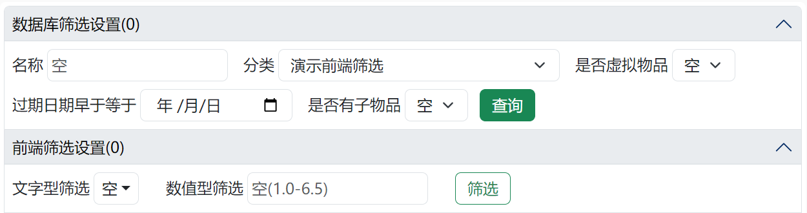

# 项目简介

## 项目背景

不知道大家有没有这样的经历：我记得我有一件这样的衣服，但是我忘记这件衣服是在我家还是在学校了🤔；我叠的整整齐齐的衣服，在翻找衣服时翻着翻着就乱套了😦；一摞鞋盒，为了找一双特定的鞋得每个都掀开看一遍，到最后还没找到😠；过年冰箱冻的肉，到了年中才被发掘出来想起来吃😵……

为了解决“东西堆成一堆后查找特定物品难”的问题，我开发了“堆叠世界”这个家庭仓储系统。

## 项目特点

“堆叠世界”的定位是家庭仓储系统，自然与传统仓储系统有所不同。传统仓储系统特点是“物品数量会变化”、“同一种物品有固定仓储位”，但是在家庭场景中，像衣服这种东西往往同一种只有一件，而且位置是不断变化的——我不可能因为衣服是从最底下拿出来的，放的时候就还要放到最底下去，这太麻烦了。大部分场景下，东西拿出来再放回去是会放到顶端的。

|       区别       |      传统仓储环境      |         家庭仓储环境         |
| :--------------: | :--------------------: | :--------------------------: |
| 同规格物品的数量 | 不止一个，可能成百上千 |   仅有一个，或仅有个位数个   |
|     物品位置     |     有固定货架位置     | 随着取用、收纳，位置不断变化 |

根据家庭仓储环境的特点，“堆叠世界”将物品组织成了树状结构，同时采用与windows文件资源管理器类似的UI界面进行展示，做到逻辑层清晰的同时上手简单。某个物品在一摞中的具体位置是根据当前摞的情况实时计算的，这样就能做到取的时候随心取，放的时候随手放。

## 名称由来

因为我们摞东西的过程很像是在操作一个栈（stack，计算机术语），同时我认为我的软件有管理所有堆起来的物品（everything）的能力，所以我将英文名定为“StackEverything”。

此外，我还很喜欢玩一款名为“堆叠大陆”的游戏，我觉得游戏里摆卡片的操作和我软件里摆物品的操作有相似之处，“堆叠”也很契合我们现实里对物品所做的操作，因此我保留了“堆叠”二字，同时用“世界”来呼应英文名的“Everything”所表达的意思，所以中文名定为“堆叠世界”。

## 使用建议

**1.不要强迫他人使用本软件**
我询问过亲戚朋友对我软件的看法，有的人对我的想法表示赞同与支持，但大多数是表示不理解，认为这就是脱了裤子放屁。请不要强迫目前不想用的人使用本软件（也就无需记录这些人的物品），否则很可能会破坏软件数据与现实世界物品的对应性，最终导致整个系统再也没有参考价值。

**2.不必保证所有物品位置都正确**
时刻保持本软件数据与现实100%对应确实是一件麻烦事，用不了多久热情就会被消磨殆尽。我建议：长时间不用的东西（例如反季衣物），确保软件数据与现实对应；最近频繁使用、移动的物品（例如最近穿的衣物），不必让数据和现实百分百对应；物品数量有限的集合，也不必保证100%对应，例如出去旅游，总共就带这么几件衣服，知道东西都在行李箱里也就差不多了。

**3.拿取衣物等柔软物品时要小心**
根据我的经验，拿取衣物时最好将目标上方衣物托举起来或移开再拿目标物品，否则很容易把堆搞乱。

**4.衣服最好根据厚度分堆放**
根据我的经验，春夏秋比较薄的衣物可以折的比较小，冬季衣物折好后占地面积较大，因此最好将两者分开摆，以确保堆的稳定性以及最大化空间利用率。

# 使用说明

## 页面选择
无论您现在在哪个页面，点击左上角的右箭头标志都可打开页面选择菜单  

  

展开后，总共有四个页面可供选择，分别是①操作区、②物品浏览、③属性管理、④帮助。

操作区主要用来对软件中的物品进行操作，包括新增、删除、移动等。
物品浏览主要用来查找物品。
属性管理主要用来管理物品的分类，以及某类物品所拥有的属性。
帮助主要用来查看操作说明

## 操作区

### 总览

操作区整体上分为左右两个部分，这两部分功能上完全相同，仅仅是为了方便物品在不同目录下移动。

1. 多选：点击可切换多选激活状态。
2. 快速移动：点击弹出下拉框，可选择的模式有“快速插入”、“快速吸收”和“传送门”。
3. 元素大小：点击弹出输入框，可改变物品图标大小。
4. 地址栏：显示当前所处路径。打开页面时会自动跳转上次打开的路径。
5. 返回：切换到前一个路径。
6. 前进：切换到后一个路径。
7. 上移：切换到父目录。
8. 跳转：点击后可输入目标目录，直接跳转。
9. 新增：点击后打开新增物品界面。
10. 物品展示区：物品会在这里显示。
11. 物品：普通状态（多选、快速移动均未激活）下，单击是进入目录，长按是查看/修改物品，拖拽是移动物品。
12. 物品次序：物品在当前目录的位置。
13. 物品名称：物品名称。
14. 安全区：为移动端安全滑动屏幕预留，因为在物品展示区滑动页面会被系统认为是拖拽物品。

### 新增物品

点击新增按钮即可在当前目录的顶端新增一个物品。信息填写界面如下

标题处，会指明当前新增元素的目录是哪个。

图片，点击上传图片按钮可以为物品指定图片，如果是移动端还可以拍照上传。上传后可以对图片进行裁剪、选择是否压缩原图（压缩设置可在config.py里修改）。

名称，需要填写一个独一无二的名称，右侧可以勾选重名自动加编号，这样出现重名时会自动加一个数字后缀避免重名。必填。

分类，需要选择当前物品的分类，必填。

属性，在选定分类后会展示该分类下拥有的属性，可以对属性进行选择。

是否为虚拟物品，用来标识这个物品有没有物理实体，方便后续筛选。

过期日期，用来记录物品的过期日期，用来筛选临期物品。

备注，用来补充说明关于该物品的其他信息。

最后点击右下角的新增即可，如果页面顶部弹出绿色的“新增成功”提示，说明物品新增成功，否则需要根据错误提示对填写内容进行更改。

### 查看/修改/删除物品

在普通状态（多选、快速移动均未激活）下，长按目标物品即可进入编辑物品界面，界面样式与新增元素类似。点击右下角更新按钮可更新物品；点击右下角删除按钮可删除物品，如果物品中含有其他物品，在删除按钮处会提示“含子物品”，删除该物品会递归删除该物品下的所有子物品，删除成功后会在页面顶部弹出提示，显示本次删除的物品个数。如果不想进行更改或删除，点击右上角的X即可关闭该页面

### 切换目录

切换目录有四种操作方法，一是在普通状态（多选、快速移动均未激活）下点击物品进入目录

二是在地址栏点击想要跳转的目录进行跳转

三是通过返回、前进、上移三个按钮进行目录切换

四是通过跳转按钮跳转到指定目录

### 移动物品

在普通状态（多选、快速移动均未激活）下，拖拽物品即可对物品进行移动。

当拖拽到目标左侧时，目标左侧会亮起蓝色光晕，此时释放被拖拽物品，被拖拽物品将移动到目标物品左侧

当拖拽到目标右侧时，目标右侧会亮起蓝色光晕，此时释放被拖拽物品，被拖拽物品将移动到目标物品右侧

当拖拽到目标中间时，目标四周会亮起蓝色光晕，此时释放被拖拽物品，被拖拽物品将移动到目标内

当拖拽到无物品的区域时，区域会亮起蓝色光晕，此时释放被拖拽物品，被拖拽物品将移动到区域内；当拖拽到有物品的区域时，区域第一个元素左侧会亮起蓝色光晕，此时释放被拖拽物品，被拖拽物品将移动到区域最顶部

当拖拽到物品展示区以外，或者拖拽到原位置时释放，会取消操作

当拖拽物品过快时，会触发误触保护，此功能主要是为了防止移动端误操作，移动端进行上下滚动页面时需要在无物品的安全区内滑动

### 多选移动物品

点击多选按钮启用多选功能，此功能用来确保移动物品时保持原有物品次序不变。多选开启时：
点击元素会切换物品的选中状态，选中时发绿光

长按物品会进行范围选择，第一次长按的物品会发橙光，物品是切换为选中还是取消选中取决于第二次长按的物品，第二次长按物品一开始未选中，则范围内全选中，第二次长按物品一开始处于选中，则范围内全取消选中

拖动仍旧是移动物品

### 快速移动物品

快速移动有三个模式，分别为快速插入、快速吸收和传送门。启用快速移动后，启用侧将只有点击和长按功能，且点击物品不可进入物品，而是响应快速移动功能；长按仍旧是打开查看/更改/删除物品界面。

激活快速插入后，点击激活侧的物品，可将该物品快速移动到对侧顶部

激活快速吸收后，点击激活侧的物品，可将对侧顶部物品移动到自己内部

激活传送门后，第一次点击的物品会发橙光，指示其为目的地，再次点击该物品会取消将其作为目的地。存在目的地时，点击其他物品会把点击的物品移动到目的地内部

### 调整物品图片大小

点击元素大小按钮，会弹出一个输入框，输入你想要的边长后再次点击元素大小按钮，就可以改变对应侧的物品图片大小。此数值会被记录。

## 物品浏览

为了减轻服务器压力，同时提高前端响应速度，物品浏览界面数据采取了三步走的策略，即第一步通过数据库筛选设置，确定需要从数据库拉取的物品大致范围，然后从数据库拉取相关数据并临时存储在本地内存中；第二步通过前端筛选设置从本地内存中进行属性筛选，筛选出具体需要展示的物品；第三步通过展示设置，设置物品需要展示的信息，然后再把需要展示的物品渲染到前端。

### 数据库筛选设置

总共有四项可供筛选，分别是名称、分类、是否虚拟物品、过期日期早于等于。可选择填写任意项进行筛选。

其中名称筛选的规则是只要物品名称中包含所填写内容，即可被筛选。

点击查询后，从数据库拉取的物品个数会显示在标题“数据库筛选设置”后的括号内，即现在图上显示“(-)”的地方。

可点击标题折叠或展开数据库筛选设置。

### 前端筛选设置

只有在数据库筛选设置选择了分类，前端筛选设置才会显示所选分类具有的属性。

下面将以演示物品1-4进行演示。演示物品1-3的“文字型筛选”属性分别是衣服1-3，“数值型筛选”属性分别是1-3，而演示物品4的两个属性都是空。（有关文字型筛选和数值型筛选的介绍请见“属性管理”章节）

文字型筛选是以多选的形式进行选择，例如我们筛选衣服1和空白，就会把演示物品1和4筛选出来

数值型筛选可填写单数值、范围数值、空值，范围数值用“-”连接最小值和最大值，要表示空值直接写上空。可混合填写，混合填写时用“,”（中英文均可）分开各项。例如填写“1，3-3.5，空”即可将衣服1、衣服3、衣服4筛选出来。

### 展示设置

展示设置的所有项都是会被记录的，打开时会保持和上次一样的设置

卡片数量是每页展示的卡片数量；卡片宽度是整个卡片的宽度；图片边长是卡片里物品图片的宽度；其余各勾选项均顾名思义。

### 翻页

点击“<<”可跳转至第一页，点击“<”可前翻一页，点击“>”可后翻一页，点击“>>”可跳转至最后一页。点击下拉菜单可手动选择跳转的页数。

### 物品交互

点击物品图片，可弹出查看/修改/删除物品界面。

## 属性管理

属性管理界面可设置分类与属性，可以理解为一级分类和二级分类。例如分类可以有衣服、药品、工具，然后每个分类有自己具体的属性，比如衣服有季节、部位等属性。

### 新增分类

点击分类侧的新增按钮，即可弹出新增分类弹窗。输入分类名称后点击提交即可新增一个分类。

### 管理分类

点击分类侧的管理按钮，即可对分类进行排序、删除，此时管理按钮会变为完成按钮。完成管理后点击完成按钮即可保存结果。需要注意的是，如果要删除分类，需要确保没有物品在使用这个分类。

### 新增属性

首先需要选中一个分类才可以对选中的分类新增属性，点击属性侧的新增属性后，即可弹出新增属性弹窗。

名称：不能和本分类下其他属性重名。

类型：分为文字型和数值型。文字型是提供一系列离散值供选择，例如，衣服的季节属性有春秋、夏、冬。数值型用来描述含有数值的属性，例如，工具的长度属性可以用数值表示。

范围：用来填写该属性的合法范围，如果是文字型，就是填写一系列选项；如果是数值型，就是填写数值范围。

备注：用来对属性进行备注，例如备注工具的长度属性，使用的度量单位是什么。

### 管理属性

点击某个属性，可以更改这个属性的范围和备注。

需要注意的是，在缩减范围时，不能有物品的属性处于新范围外。需要先把会超出新范围的物品的属性改为不超范围后，才可以缩减范围。

点击属性侧的管理按钮，即可对属性进行排序、删除，此时管理按钮会变为完成按钮。完成管理后点击完成按钮即可保存结果。需要注意，即使有物品在使用某属性，仍可将该属性删除。

